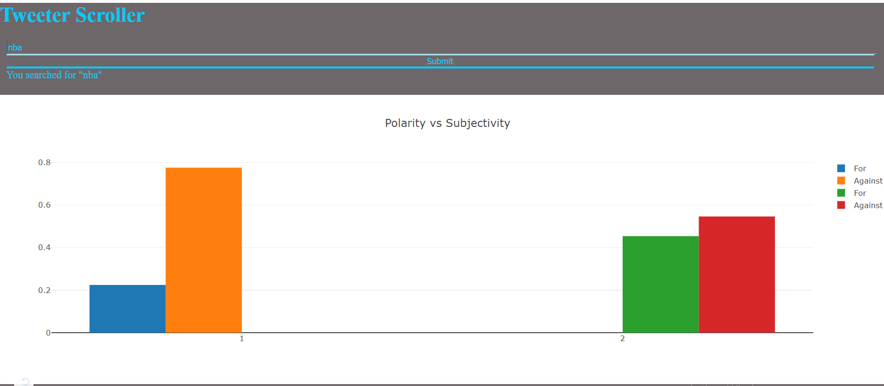
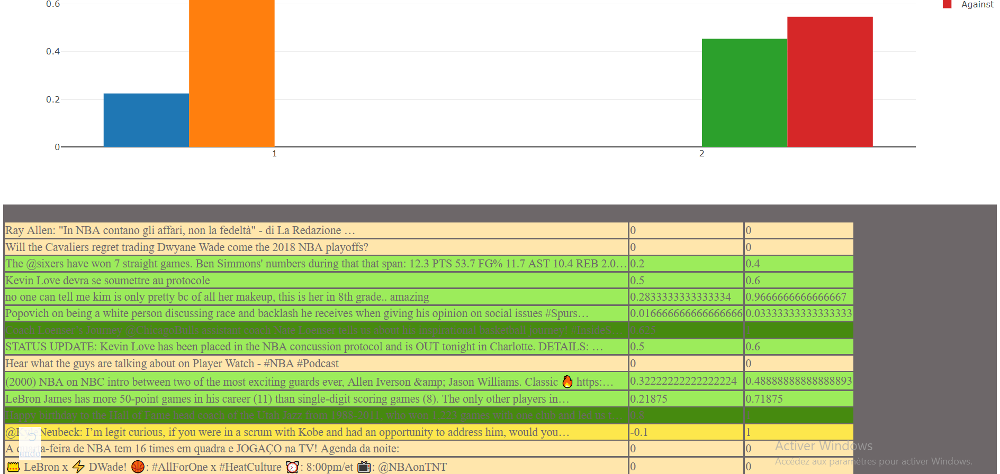

# TwitterScroller
Scroll and Sentiment Analysis to tweets , created with Python and Dash

# Requirements : 
* Python > 3.5
* tweepy
* textblob
* dash

# How it works : 
Pretty simple in fact ..
  ### tweeterScroller.py  : 
Connect and collect the tweets , delete the unuseful part and store them in dataFrame. In the whole process, this script works in basically in background. Go to apps.twitter.com to set that up if you need to
  ### dashPlot.py : 
Read Query from user and send it to tweeterScroller.py , get the response and show it in a web format with two graphs after sentiment analysis done with textblob. The informations will be refreshed each 5 seconds to be updated.

# Coming Update : 
Code is not finished yet, still a lot of work to be done to get everything clean and well written.
Other graphs could be added, as well as, changing colors (never said that i have a good taste)

### e-mail : 
dim.wael@gmail.com
